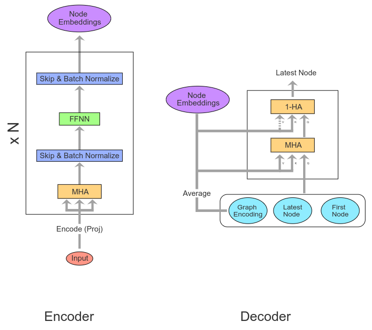

# Attention Model for Vehicle Routing Problems
## Tensorflow 2.0 implementation of <a href="https://arxiv.org/abs/1803.08475">Attention, Learn to Solve Routing Problems!</a> article.

### <a href="https://github.com/d-eremeev/">Dmitry Eremeev</a>, <a href="https://github.com/alexeypustynnikov">Alexey Pustynnikov</a>

This work was done as part of a final project for <a href="http://deeppavlov.ai">DeepPavlov </a> course: <a href="http://deeppavlov.ai/rl_course_2020">Advanced Topics in Deep Reinforcement learning</a>.

Code of the full project (<a href="https://arxiv.org/abs/2002.03282">dynamic version</a>) is located at https://github.com/d-eremeev/ADM-VRP

#### Enviroment:

Current enviroment implementation is located in **Enviroment.py** file - AgentVRP class.

The class contains information about current state and actions that were done by agent.

Main methods:

- **step(action)**: transit to a new state according to the action.
- **get_costs(dataset, pi)**: returns costs for each graph in batch according to the paths in action-state space.
- **get_mask()**: returns a mask with available actions (allowed nodes).
- **all_finished()**: checks if all games in batch are finished (all graphes are solved).

Let's connect current terms with RL language (small dictionary):

- **State**: $X$ - graph instance (coordinates, demands, etc.) together with information in which node agent is located.
- **Action**: $\pi_t$ - decision in which node agent should go.
- **Reward**: The (negative) tour length.

#### Model Training:

AM is trained by policy gradient using <a href="https://link.springer.com/article/10.1007/BF00992696">REINFORCE </a> algorithm with baseline.

**Baseline**

- Baseline is a <b>copy of model</b> with fixed weights from one of the preceding epochs.
- Use warm-up for early epochs: mix exponential moving average of model cost over past epochs with baseline model.
- Update baseline at the end of epoch if the difference in costs for candidate model and baseline is statistically-significant (t-test).
- Baseline uses separate dataset for this validation. This dataset is updated after each baseline renewal.

# Files Description:

 1) **Enviroment.py** - enviroment for VRP RL Agent
 2) **layers.py** - MHA layers for encoder
 3) **attention_graph_encoder.py** - Graph Attention Encoder
 4) **attention_graph_decoder.py** - Graph Attention Decoder
 5) **attention_model.py** - Attention Model
 6) **reinforce_baseline.py** - class for REINFORCE baseline
 7) **train.py** - defines training loop, that we use in train_with_checkpoint.ipynb
 8) **train_with_checkpoint.ipynb** - from this file one can start training or continue training from chechpoint
 9) **generate_data.py** - various auxiliary functions for data creation, saving and visualisation
 10) results folder: folder name is ADM_VRP_{graph_size}_{batch_size}. There are training logs, learning curves and saved models in each folder 
 
 # Training procedure:
  1) Open  **train_with_checkpoint.ipynb** and choose training parameters.
  2) All outputs would be saved in current directory.

# Details of Files

## `attention_graph_encoder.py`

The attention graph encoder utilizes an almost-intact encoder architecture from the transformer. There is no positional encoding and several linear projections (Dense layers with no activation) are used for conducting the embedding step.

### `class MultiHeadAttentionLayer`

This class defines a single encoding unit. It will not support embedding (done a-priori). All moving parts as defined in the paper are created in constructor and call function connects them together.

### `class GraphAttentionEncoder`

This class defines the full encoder defined in Kool et al. The constructor sets up the embedding layer. The embedding uses two Dense layers. One for passingl only the depot location and another for the rest of nodes. This is important to note since the depot and rest of nodes are not passed through the same embedding layer. Finally, the Multi Headed Attention Layers are stacked together in a list.

The call function simply connects the moving pieces, abstracting away from the multiheaded attention units.